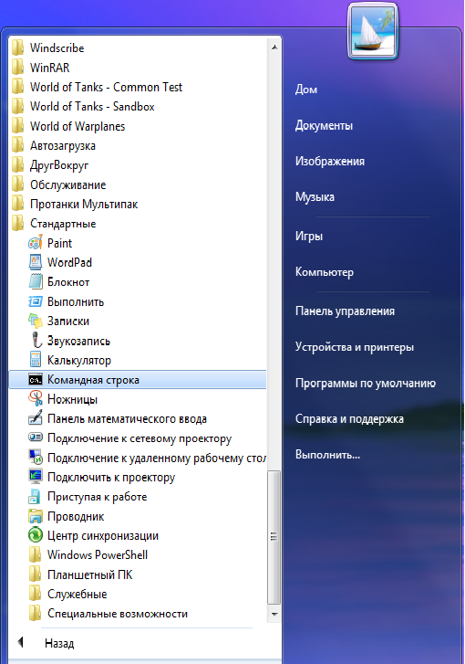

[< к содержанию](./readme.md)

[< предыдущая](./Установка_программы_Git.md)

[далее >](./Команды_Git.md)

# Как открыть командную строку

Чтобы открыть командную строку, пройдите по следующему пути: *«Пуск - Служебные - Windows - Командная строка»* или *«Пуск — Все программы — Стандартные — Командная строка»* (Windows 7)

Или запустите командную строку (терминал, консоль), нажав сочетание клавиш "Win+R" и наберите команду cmd

[далее >](./Команды_Git.md)
