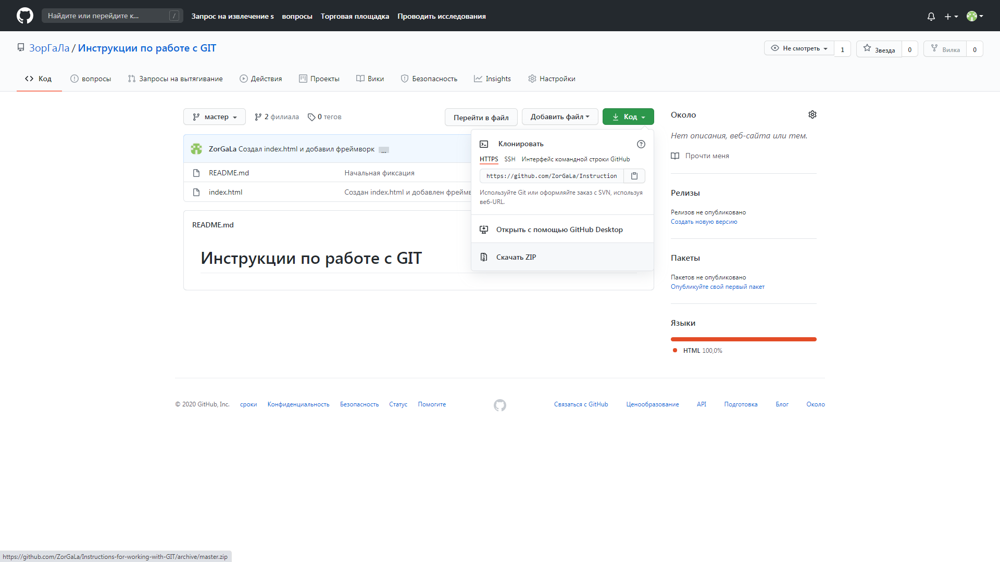

[< к содержанию](./readme.md)

[< предыдущая](./Управление_проектом.md)

[далее >](./Работа_с_проектом.md)

# Как скачать проект

Для того, чтобы скачать проект к себе на компьютер, нужно нажать на кнопку "Код" ("Clone or download")

Или, для дальнейшей работы через терминал (командную строку), можно здесь же скопировать ссылку на проект

[далее >](./Работа_с_проектом.md)
