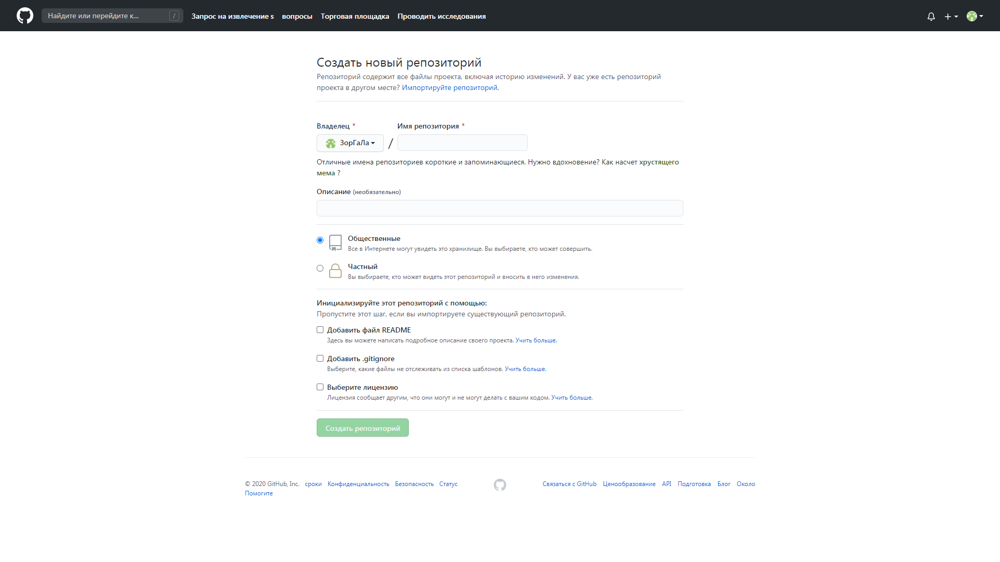

[< к содержанию](./readme.md)

[< предыдущая](./Команды_Git.md)

[далее >](./Файл_.gitignore.md)

<<<<<<< HEAD:Создание_проекта_на_GidHub.md
# Создание проекта на GitHub
=======
# Создание проекта на GidHub
>>>>>>> 91972e948408e7b4e20b160f16940211f66f01ec:Создание проекта на GitHub.md

**Создаем новый проект**, нажав кнопку *"Start a project"*.
В графе *"Repository name"* пишете название вашего проекта.
Далее можно выбрать *публичный*, ваш проект будет виден всем или *приватный* (он платный), где вы сами выбираете, кто может видеть этот репозиторий и вносить в него изменения.

Можно поставить галочки, чтобы добавить, если это необходимо, файлы readme (чтобы можно было, например, сразу сделать клон вашего репозитория) и .gitignore (в который вы введете перечень файлов, версии которых отлеживаться не будут, например, файлы вашей операционной системы).
Подробнее на стр. "[Файл .gitignore](./Файл_.gitignore.md)"

[далее >](./Файл_.gitignore.md)
