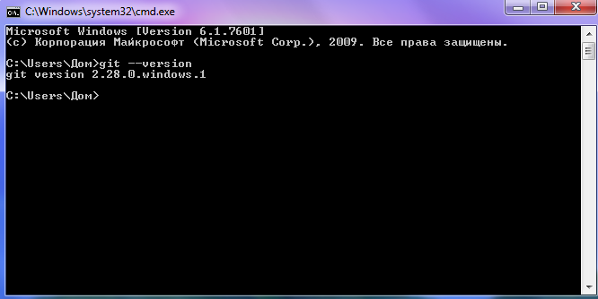

[< к содержанию](./readme.md) 

[< предыдущая](./GitHub.md)

[далее >](./Как_открыть_командную_строку.md)

# Установка программы *Git* на компьютер

Чтобы проверить наличие, уже установленной программы, если вы её ранее устанавливали, в командной строке выполните команду ***`git --version`***
(подробнее на странице "[Как_открыть_командную_строку](./Как_открыть_командную_строку.md)").

Если программа уже была установлена, вам будет показано какой она версии.

Если нет, то:

- **Для Windows**:
 перейдите по ссылке, чтобы скачать программу: <https://git-scm.com/download/win>

- **Для Linux Ubuntu (CLI apt)**:
введите команду в терминале, для установки:
`$sudo apt install git`

- **Для MacOS**:
Вам будет предложено его установить

Запустив программу, вам потребуется ввести ваш логин и пароль, которые вы указывали при регистрации на сайте

[далее >](./Как_открыть_командную_строку.md)
